```{r setup, include=FALSE}
options(htmltools.dir.version = FALSE)
knitr::opts_chunk$set(
  fig.width=9, fig.height=3.5, fig.retina=3,
  out.width = "100%",
  cache = FALSE,
  echo = TRUE,
  message = FALSE, 
  warning = FALSE,
  fig.show = TRUE,
  hiline = TRUE
)
```

```{r xaringan-themer, include=FALSE, warning=FALSE}
library(xaringanthemer)
style_duo_accent(
  primary_color = "#053061",
  secondary_color = "#053061",
  inverse_header_color = "#FFFFFF"
)
```

class: inverse center middle

# Introduction


```{r ,echo=FALSE,fig.height=7,fig.width=16,out.width='100%',out.height='100%'}
#library(ggplot2)
#Year<-c(2010:2020)
#Dengue<-c(25559,21079,23792,22213,34775,23010,32695,174025,51938,92467,35397)
#df<-data.frame(Year,Dengue)
#S1<-ggplot(df, aes(x=as.factor(Year), y=Dengue, fill=Dengue)) + 
#  geom_bar(stat = "identity", color="#b2182b", fill="#b2182b")+ theme(legend.position = #'none')+
#  labs(x="Year", y = "Dengue counts")
#S1
knitr::include_graphics("Figures/INT.JPG")
```

---

class: inverse center middle

```{r figurechapter02, echo=FALSE, fig.align = 'center',message=FALSE, out.width = '100%', out.height = '100%',fig.height=5, fig.width=10}
knitr::include_graphics("Figures/F1.JPG")
```

---

class: inverse center middle

# Data

---

* Epidemiological unit, Ministry of Health, Sri Lanka.

  *  https://www.epid.gov.lk/web/index.php?option=com_content&view=article&id=148&Itemid=449&lang=en

* Format of the table in the Epidemiological Report

```{r figurechapter03, echo=FALSE, fig.align = 'center',message=FALSE, out.width = '100%', out.height = '40%',fig.height=5, fig.width=10}
knitr::include_graphics("Figures/F3.JPG")
```

---

# Reading PDF files

#### Reading_EpidemiologicalReports function

```{r }
#' path <- setwd(here::here("pdffiles","2020"))
#' startdate <- c("2019-12-21","2019-12-27","2019-12-28","2020-01-03","2020-01-04","2020-01-10","2020-01-11","2020-01-17","2020-01-18","2020-01-24","2020-01-25","2020-01-31","2020-02-01","2020-02-07","2020-02-08","2020-02-14","2020-02-15","2020-02-21","2020-02-22","2020-02-28","2020-02-29","2020-03-06","2020-03-07","2020-03-13","2020-03-14","2020-03-20","2020-03-21","2020-03-27","2020-03-28","2020-04-03","2020-04-04","2020-04-10","2020-04-11","2020-04-17","2020-04-18","2020-04-24","2020-04-25","2020-05-01","2020-05-02","2020-05-08","2020-05-09","2020-05-15","2020-05-16","2020-05-22","2020-05-23","2020-05-29","2020-05-30","2020-06-05","2020-06-06","2020-06-12","2020-06-13","2020-06-19","2020-06-20","2020-06-26","2020-06-27","2020-07-03","2020-07-04","2020-07-10","2020-07-11","2020-07-17","2020-07-18","2020-07-24","2020-07-25","2020-07-31","2020-08-01","2020-08-07","2020-08-08","2020-08-14","2020-08-15","2020-08-21","2020-08-22","2020-08-28","2020-08-29","2020-09-04","2020-09-05","2020-09-11","2020-09-12","2020-09-18","2020-09-19","2020-09-25","2020-09-26","2020-10-02","2020-10-03","2020-10-09","2020-10-10","2020-10-16","2020-10-17","2020-10-23","2020-10-24","2020-10-30","2020-10-31","2020-11-06","2020-11-07","2020-11-13","2020-11-14","2020-11-20","2020-11-21","2020-11-27","2020-11-28","2020-12-04","2020-12-05","2020-12-11","2020-12-12","2020-12-18")
#' year <- c(2019,2020,2020,2020,2020,2020,2020,2020,2020,2020,2020,2020,2020,2020,2020,2020,2020,2020,2020,2020,2020,2020,2020,2020,2020,2020,2020,2020,2020,2020,2020,2020,2020,2020,2020,2020,2020,2020,2020,2020,2020,2020,2020,2020,2020,2020,2020,2020,2020,2020,2020,2020)
#' week <- c(52,1,2,3,4,5,6,7,8,9,10,11,12,13,14,15,16,17,18,19,20,21,22,23,24,25,26,27,28,29,30,31,32,33,34,35,36,37,38,39,40,41,42,43,44,45,46,47,48,49,50,51);
#' Cname <- c("Division","Dengue","Dengue B","Dysentery","Dysentery B","Encephalitis",
#'        "Encephalitis B","Enteric Fever","Enteric Fever B","Food Poisioning",
#'        "Food Poisioning B","Leptospirosis","Leptospirosis B","Typhus Fever",
#'        "Typhus Fever B","Viral Hepatistis","Viral Hepatistis B","Human Rabies",
#'        "Human Rabies B","Chickenpox","Chickenpox B","Meningitis",
#'        "Meningitis B", "Leishmaniasis","Leishmaniasis B")
#' DeletingRows <- c(1,2,3,30,31,32,33,34)
#' TotalColmns <- 27
#' PercentageColmns <- c(26,27)
#' DeleteColmns <- c(3,5,7,9,11,13,15,17,19,21,23,25)
#' Weeks_2020 <- Reading_EpidemiologicalReports(path,startdate,year,week,Cname,DeletingRows,TotalColmns,PercentageColmns,DeleteColmns)

```

---

# Reading PDF files

```{r figurechapter07, echo=FALSE, fig.align = 'center',message=FALSE, out.width = '70%', out.height = '10%',fig.height=5, fig.width=10}
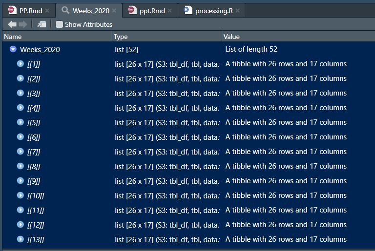
```

---

# Reading Excel files

```{r }
Processed_Data<-function(processed_data_path)
{
  Disease_Counts_csv <- list.files(path = ".", pattern = NULL, all.files = FALSE,
                                   full.names = FALSE, recursive = FALSE,
                                   ignore.case = FALSE, include.dirs = FALSE, no.. = FALSE)
  Data_Counts <- tsibble::as_tibble (data.table::rbindlist (lapply (Disease_Counts_csv , data.table::fread),fill = T))
  Data_Counts <- dplyr::relocate(Data_Counts, Year,Week,StartDate,EndDate,.before=Division)
  Data_Counts <- dplyr::arrange(Data_Counts, StartDate)
  setwd(here::here("data"))
  save (Data_Counts, file = 'FinalData.Rda')
  return(Data_Counts)
}
```

---

# DISC (DISease Counts) Package

```{r ,echo=FALSE}
library(tsibble)
library(magrittr)
library(forecast)
library(ggplot2)
library(tsibble)
library(feasts)
library(patchwork)
library(viridisLite)
library(viridis)

load("E:/MScProgressPresentation/MScProgressPresentation/data/AllData.Rda")

D<-Data_Counts
D
```

---

# DISC (DISease Counts) Package


```{r figurechapter08, echo=FALSE, fig.align = 'center',message=FALSE, out.width = '25%', out.height = '25%',fig.height=6, fig.width=6}

```

```{r}
#install.packages("remotes")
#remotes::install_github("SMART-Research/DISC")
```

---

# Dengue counts data

```{r ,echo=FALSE}
Week<-tsibble::yearweek(D$EndDate)
Date<-D$EndDate
Province<-rep(c(rep("Western",3),rep("Central",3),rep("Southern",3),rep("Nothern",5),
                rep("Eastern",3),rep("NorthWestern",2),rep("NorthCentral",2),
                rep("Uva",2),rep("Sabaragamuwa",2),rep("Eastern",1)),730)
Districts<-D$Division
Counts<-as.integer(D$Dengue)

```

.left-column[
```{r figurechapter010t, echo=FALSE, fig.align = 'center',message=FALSE, out.width = '80%', out.height = '80%',fig.height=4, fig.width=4}

```
]

.right-column[
```{r ,highlight.output=c(1, 2)}
DengueTEST<-tibble(Week,Date,Counts,Districts,Province)
DataDengueTEST<- DengueTEST%>% 
  as_tsibble(key=c(Province,Districts),index=Week)#<<
DataDengueTEST
```
]

---

class: inverse center middle

```{r figurechapter09, echo=FALSE, fig.align = 'center',message=FALSE, out.width = '100%', out.height = '100%',fig.height=5, fig.width=10}
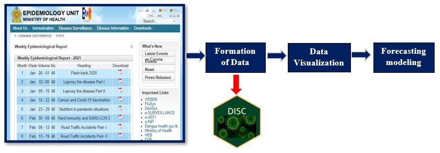
```

---

class: inverse center middle

# Data Visualization

---

# Data Visualization

*   Time domain visualization

*   Feature based visualization

*   Change point analysis

---
# Time domain visualization-Districts


```{r ,echo=FALSE, code=readLines("PD.R"),echo=FALSE,results='hide',message=FALSE,warning=FALSE}
```


```{r figurechapter09A, echo=FALSE, fig.align = 'center',message=FALSE, out.width = '90%', out.height = '80%',fig.height=7, fig.width=14}
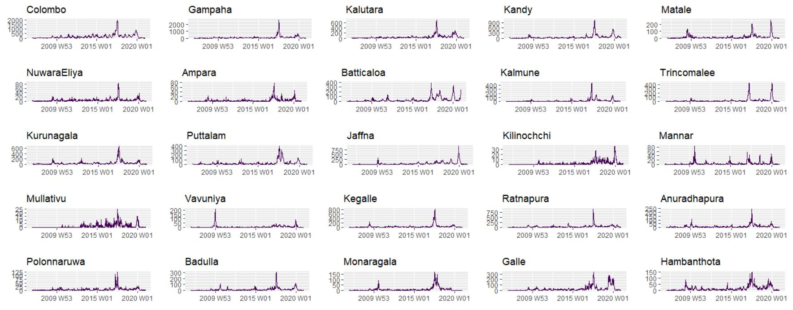
```

---
# Time domain visualization-Districts

```{r ,echo=FALSE, out.width = '100%', out.height = '100%',fig.height=7, fig.width=14}
plotly::ggplotly(HM2)
```

---

# Min-Max Transformation

$$\frac{x_{i}-min(x)}{max(x)-min(x)}$$
where $x=(x_{1},x_{2},\dots,x_{n})$.

* Rescaling dengue counts of all districts onto 0-1 range.

---

# Time domain visualization-Districts


```{r ,echo=FALSE, out.width = '100%', out.height = '80%',fig.height=7, fig.width=16}
plotly::ggplotly(HMT2)
```

---

# Feature-based visualization

```{r figurechapter09FB, echo=FALSE, fig.align = 'center',message=FALSE, out.width = '100%', out.height = '100%',fig.height=9, fig.width=16}
knitr::include_graphics("Figures/FES1.JPG")
```


---

# Time series features

.left-column[
```{r figurechapter010, echo=FALSE, fig.align = 'center',message=FALSE, out.width = '80%', out.height = '80%',fig.height=4, fig.width=4}

```
]

.right-column[
```{r}
Dengue_features<-DataDengueTEST %>% 
                 features(Counts, feature_set(pkgs = "feasts"))
colnames(Dengue_features[,-c(1:2)])
```
]

---

# Spatial hierarchical structure

```{r figurechapter0004r1, echo=FALSE, fig.align = 'center',message=FALSE, out.width = '80%', out.height = '10%',fig.height=4, fig.width=10}
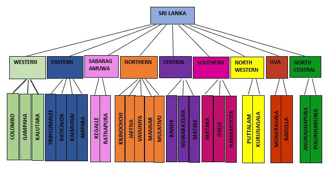
```

---

# Time series features

```{r ,echo=FALSE}
SHS_DataDengueTEST<-DataDengueTEST%>%fabletools::aggregate_key(Province/Districts,Counts=sum(Counts))
```


```{r}
Dengue_features<-SHS_DataDengueTEST %>% features(Counts, feature_set(pkgs = "feasts"))
Dengue_features
```

---

# Feature-based visualization

```{r figurechapter09FB2, echo=FALSE, fig.align = 'center',message=FALSE, out.width = '90%', out.height = '70%',fig.height=9, fig.width=16}
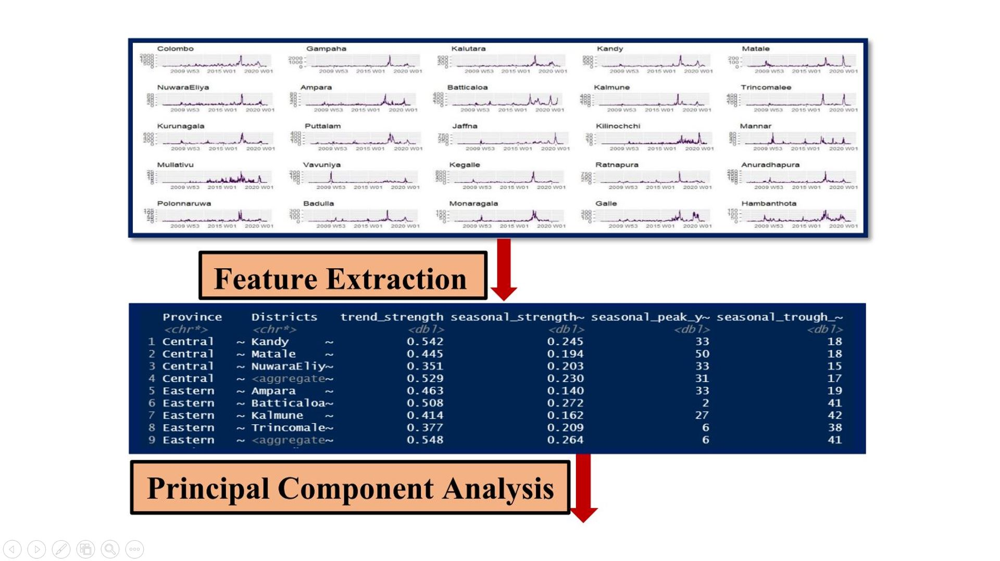
```

---

# Excluded features from PCA

```{r ,echo=FALSE}
Dengue_features %>%
  dplyr::select(c(1,2,31,33,35,37))
```

---

# Principal Component Analysis

```{r ,echo=FALSE}
library(broom)
```

```{r}
pcs<-Dengue_features%>% dplyr::select(-c(1,2,31,33,35,37)) %>% prcomp(scale = TRUE) %>%
  augment(Dengue_features)
pcs
```

---

# Principal Component Analysis


```{r ,echo=FALSE}
library(broom)
pr<-prcomp(Dengue_features[,-c(1,2,31,33,35,37)],scale=TRUE)
library(factoextra)
fviz_eig(pr)
```

---

class: inverse center middle

# Feature-based visualization

---

```{r ,echo=FALSE, out.width = '100%', out.height = '100%',fig.height=9, fig.width=16}
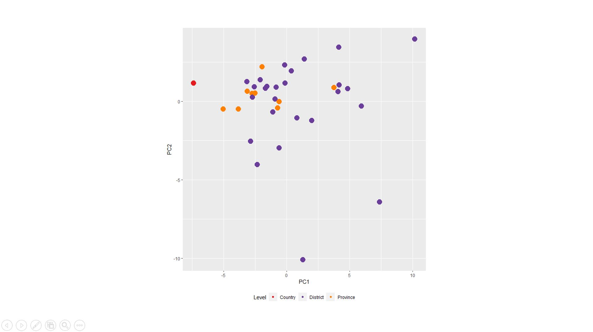
```

---

```{r ,echo=FALSE, out.width = '100%', out.height = '100%',fig.height=9, fig.width=16}
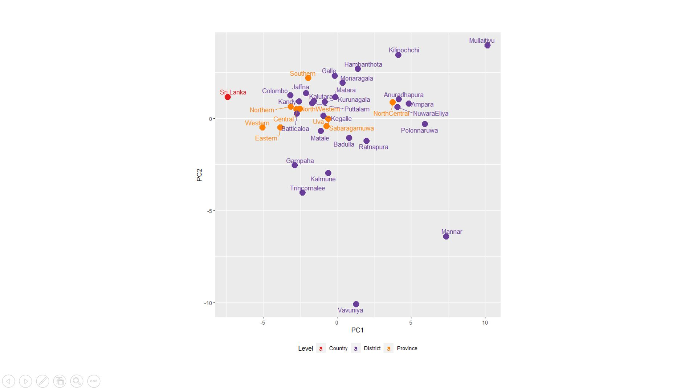
```

---

```{r ,echo=FALSE, out.width = '100%', out.height = '100%',fig.height=9, fig.width=16}
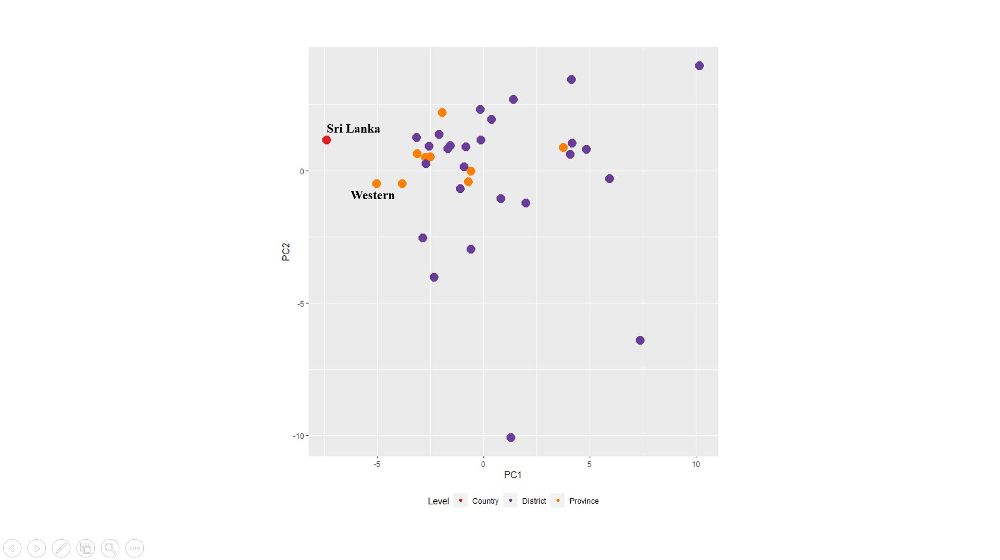
```

---

```{r ,echo=FALSE, out.width = '100%', out.height = '100%',fig.height=9, fig.width=16}
knitr::include_graphics("Figures/PP4.JPG")
```

---

```{r ,echo=FALSE, out.width = '100%', out.height = '100%',fig.height=9, fig.width=16}
knitr::include_graphics("Figures/PP5.JPG")
```

---

```{r ,echo=FALSE, out.width = '100%', out.height = '100%',fig.height=9, fig.width=16}
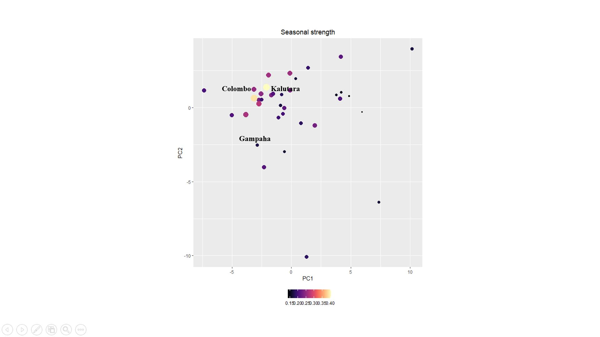
```

---

```{r ,echo=FALSE, out.width = '100%', out.height = '100%',fig.height=9, fig.width=16}
knitr::include_graphics("Figures/PP7.JPG")
```

---

```{r ,echo=FALSE, out.width = '100%', out.height = '100%',fig.height=9, fig.width=16}
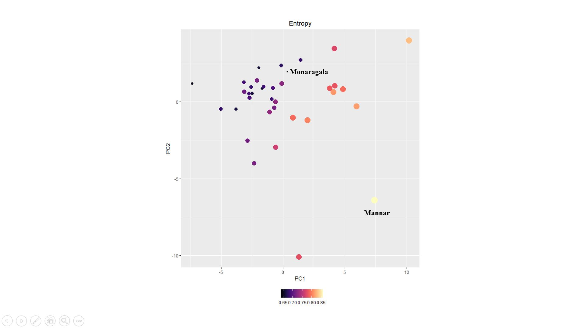
```

---

```{r ,echo=FALSE, out.width = '100%', out.height = '100%',fig.height=9, fig.width=16}
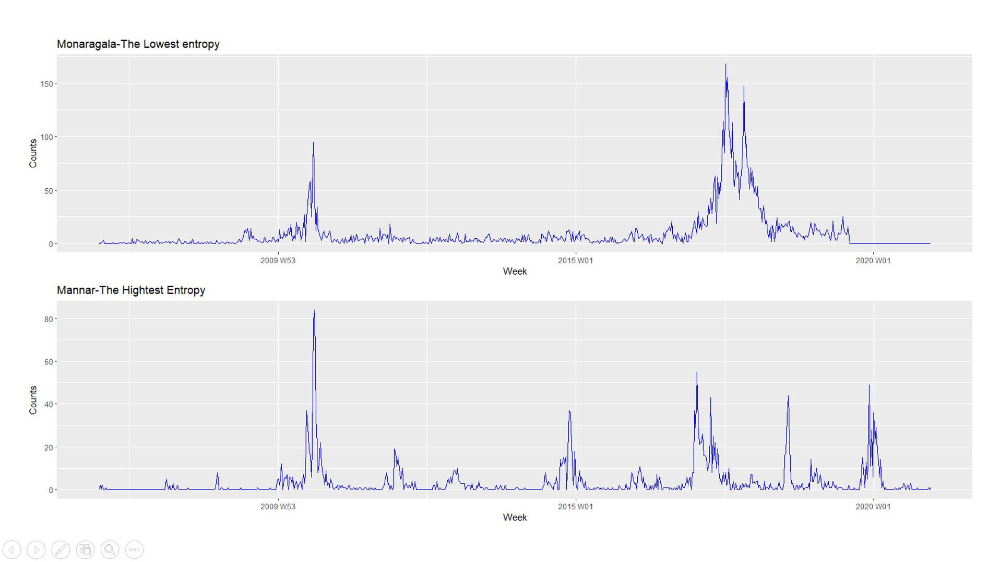
```

---

```{r ,echo=FALSE, out.width = '100%', out.height = '100%',fig.height=9, fig.width=16}
knitr::include_graphics("Figures/PP10.JPG")
```

---

```{r ,echo=FALSE, out.width = '100%', out.height = '100%',fig.height=9, fig.width=16}
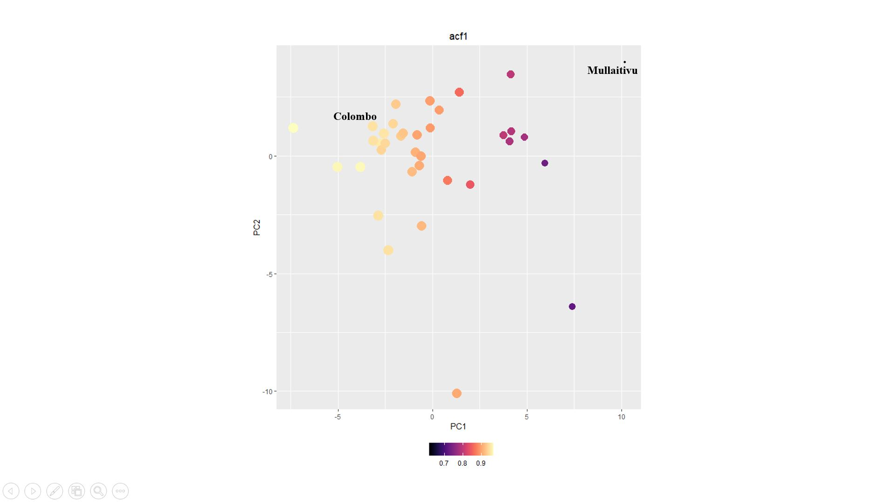
```

---

```{r ,echo=FALSE, out.width = '100%', out.height = '100%',fig.height=9, fig.width=16}
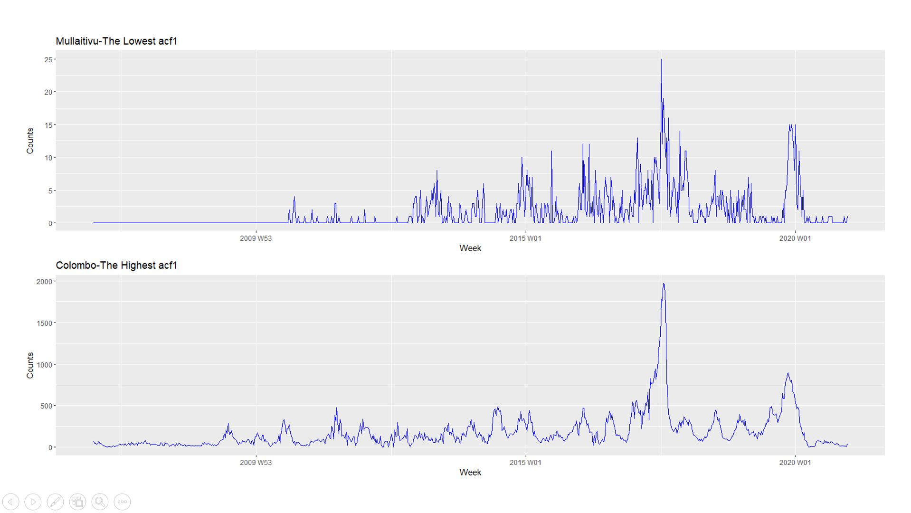
```

---

```{r ,echo=FALSE, out.width = '100%', out.height = '100%',fig.height=9, fig.width=16}
knitr::include_graphics("Figures/PP13.JPG")
```

---

```{r ,echo=FALSE, out.width = '100%', out.height = '100%',fig.height=9, fig.width=16}
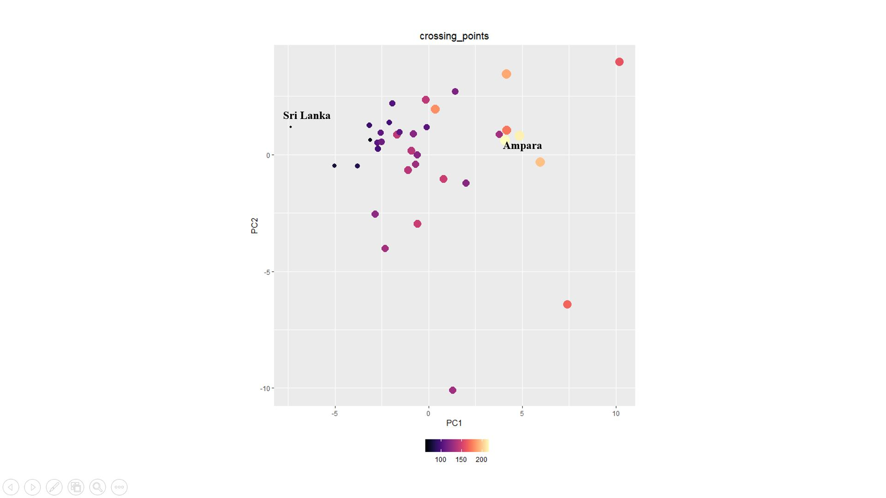
```

---

```{r ,echo=FALSE, out.width = '100%', out.height = '100%',fig.height=9, fig.width=16}
knitr::include_graphics("Figures/PP15.JPG")
```

---

# Temporal hierarchical structure

```{r figurechapter0005V1, echo=FALSE, fig.align = 'center',message=FALSE, out.width = '100%', out.height = '5%',fig.height=5, fig.width=10}
knitr::include_graphics("Figures/F11.JPG")
```

---

# Temporal hierarchical structure

```{r figurechapter0005V2, echo=FALSE, fig.align = 'center',message=FALSE, out.width = '100%', out.height = '80%',fig.height=7, fig.width=14}
TEM
```

---

# Temporal hierarchical time series features

```{r}
library(tsfeatures)
Temporal_DengueFeatures<-tsfeatures(aggts_total)
Temporal_DengueFeatures
```

---

# Excluded features from PCA

```{r}
Temporal_DengueFeatures[,c(1,10,11,12,20)]
```

---

```{r}
pr<-prcomp(Temporal_DengueFeatures[,-c(1,10,11,12,20)],scale=TRUE)
```

```{r ,echo=FALSE}
pr$rotation
```

---

# Principal Component Analysis

```{r ,echo=FALSE}
pr1<-prcomp(Temporal_DengueFeatures[,-c(1,10,11,12,20)],scale=TRUE)
fviz_eig(pr1)
```

---

```{r ,echo=FALSE, out.width = '100%', out.height = '100%',fig.height=9, fig.width=16}
knitr::include_graphics("Figures/PP16.JPG")
```

---

```{r ,echo=FALSE, out.width = '100%', out.height = '100%',fig.height=9, fig.width=16}
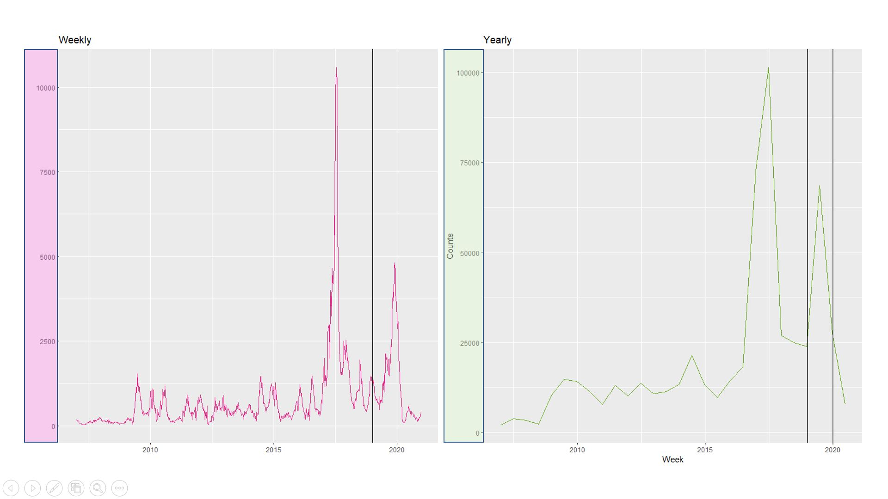
```

---

# Change point analysis

* Change point detection is the process of identifying the time point, in which properties of data suddenly change.

.pull-left[
#### Changes in mean 

```{r ,echo=FALSE}
x=1:500
z=c(rnorm(100,1,sd=0.5),rnorm(150,0,sd=0.5),rnorm(200,2,sd=0.5),rnorm(50,0.5,sd=0.5))
plot(x,z,type='l',xlab='',ylab='',col='green')
lines(x=1:100,y=rep(1,100),col='red',lwd=3)
lines(x=101:250,y=rep(0,150),col='red',lwd=3)
lines(x=251:450,y=rep(2,200),col='red',lwd=3)
lines(x=451:500,y=rep(0.5,50),col='red',lwd=3)
```

]
.pull-right[
#### Changes in variance

```{r ,echo=FALSE}
x=1:500
z=c(rnorm(100,0,sd=0.1),rnorm(150,0,sd=0.7),rnorm(200,0,sd=0.25),rnorm(50,0,sd=1))
plot(x,z,type='l',xlab='',ylab='',col='green')
```

]

---

# Change point model for changes in mean

For data $z_{1}, z_{2},\dots, z_{n}$, if change points exist at $\tau_{1}, \tau_{2}, \dots, \tau_{k}$, then 

$$z_{t}=
    \begin{cases}
    \mu_{1} &   1\leq t \leq \tau_1 \\ 
    \mu_2 & \tau_1 < t \leq \tau_2 \\
    \vdots & \vdots \\
    \mu_{k+1} & \tau_k < t \leq \tau_{k+1}=n
    \end{cases}$$


---

```{r ,echo=FALSE, out.width = '100%', out.height = '100%',fig.height=9, fig.width=16}
knitr::include_graphics("Figures/PP18.JPG")
```

---

```{r ,echo=FALSE, out.width = '100%', out.height = '100%',fig.height=9, fig.width=16}
knitr::include_graphics("Figures/PP19.JPG")
```

---

```{r ,echo=FALSE, out.width = '100%', out.height = '100%',fig.height=9, fig.width=16}
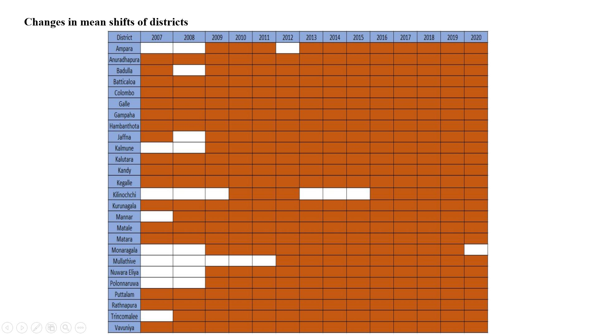
```

---

```{r ,echo=FALSE, out.width = '100%', out.height = '100%',fig.height=9, fig.width=16}
knitr::include_graphics("Figures/PP21.JPG")
```

---


class: inverse center middle

```{r figurechapter09N, echo=FALSE, fig.align = 'center',message=FALSE, out.width = '100%', out.height = '100%',fig.height=5, fig.width=10}
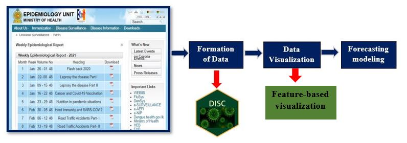
```

---

class: inverse center middle

# Forecasting modeling

---

# Spatial hierarchical structure

```{r figurechapter0004, echo=FALSE, fig.align = 'center',message=FALSE, out.width = '80%', out.height = '10%',fig.height=4, fig.width=10}

```

---

# Spatial hierarchical forecasting workflow

```{r ,echo=FALSE, out.width = '60%', out.height = '40%',fig.height=6, fig.width=6}
knitr::include_graphics("Figures/S1.JPG")
```

---

# Spatial hierarchical forecasting workflow

```{r ,highlight.output=c(1, 2)}
DengueTEST<-tibble(Week,Date,Counts,Districts,Province)
DengueTRAIN<-DengueTEST%>%dplyr::filter(lubridate::year(Week)<2020)
DataDengueTRAIN<-DengueTRAIN%>% 
  as_tsibble(key=c(Province,Districts),index=Week)#<<
DataDengueTRAIN
```


---

# Spatial hierarchical forecasting workflow

```{r ,echo=FALSE, out.width = '60%', out.height = '40%',fig.height=6, fig.width=6,fig.align='center'}
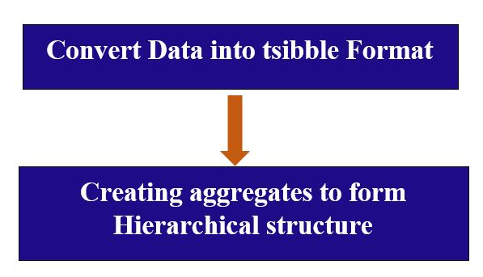
```

---

# Spatial hierarchical forecasting workflow

```{r ,highlight.output=c(1, 2)}
HS_DataDengueTRAIN<-DataDengueTRAIN%>%
          fabletools::aggregate_key(Province/Districts,Counts=sum(Counts))#<<

HS_DataDengueTRAIN
```

---

# Spatial hierarchical forecasting workflow

```{r ,echo=FALSE, out.width = '85%', out.height = '10%',fig.height=4, fig.width=10,fig.align='center'}
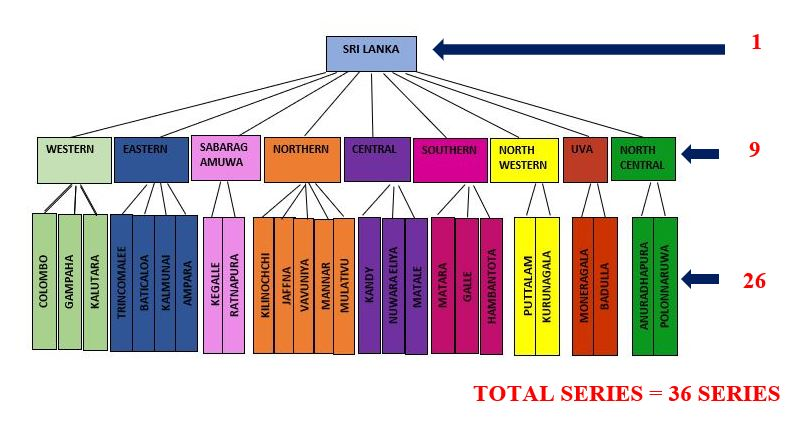
```

---

#### District level

```{r ,highlight.output=c(5,6,7)}
HS_DataDengueTRAIN%>% dplyr::filter(!is_aggregated(Districts)& !is_aggregated(Province))%>%print(n=3)
```

#### Province level

```{r ,highlight.output=c(5)}
HS_DataDengueTRAIN%>% dplyr::filter(is_aggregated(Districts)& !is_aggregated(Province))%>%print(n=3)
```

---
#### Country level

```{r}
HS_DataDengueTRAIN%>% dplyr::filter(is_aggregated(Districts)& is_aggregated(Province))%>%print(n=13)
```

---

# Spatial hierarchical forecasting workflow

```{r ,echo=FALSE, out.width = '60%', out.height = '5%',fig.height=7, fig.width=6,fig.align='center'}
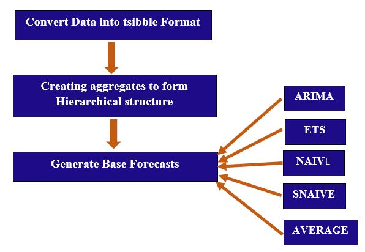
```

---

# Spatial hierarchical forecasting workflow

```{r ,echo=FALSE}
library(magrittr)
library(fabletools)
library(fable)
```

.left-column[
```{r , echo=FALSE, fig.align = 'center',message=FALSE, out.width = '80%', out.height = '80%',fig.height=4, fig.width=4}

```
]

.right-column[
```{r }
HS_DataDengueTRAIN%>%
    model(arima =ARIMA(Counts),snaive=SNAIVE(Counts),naive=NAIVE(Counts),ets=ETS(Counts),avg = MEAN(Counts))%>% forecast(h =52)%>%print(n=5)
```
]

---

# Base forecasts - SNAIVE method

```{r ,echo=FALSE,highlight.output=c(6,11,16,21)}
AGGCHECK<-HS_DataDengueTRAIN%>%
    model(arima =ARIMA(Counts),snaive=SNAIVE(Counts),naive=NAIVE(Counts),ets=ETS(Counts),avg = MEAN(Counts))%>% forecast(h =52)

AGGCHECK%>%dplyr::filter(Week==tsibble::yearweek("2020-01-03"))%>%dplyr::filter(Province=="Central")
```

---

# Base forecasts - NAIVE method

```{r ,echo=FALSE,highlight.output=c(7,12,17,22)}
AGGCHECK<-HS_DataDengueTRAIN%>%
    model(arima =ARIMA(Counts),snaive=SNAIVE(Counts),naive=NAIVE(Counts),ets=ETS(Counts),avg = MEAN(Counts))%>% forecast(h =52)

AGGCHECK%>%dplyr::filter(Week==tsibble::yearweek("2020-01-03"))%>%dplyr::filter(Province=="Central")
```

---

# Base forecasts - Average method

```{r ,echo=FALSE,highlight.output=c(9,14,19,24)}
AGGCHECK<-HS_DataDengueTRAIN%>%
    model(arima =ARIMA(Counts),snaive=SNAIVE(Counts),naive=NAIVE(Counts),ets=ETS(Counts),avg = MEAN(Counts))%>% forecast(h =52)

AGGCHECK%>%dplyr::filter(Week==tsibble::yearweek("2020-01-03"))%>%dplyr::filter(Province=="Central")
```


---

# Spatial hierarchical forecasting workflow

```{r ,echo=FALSE, out.width = '50%', out.height = '5%',fig.height=7, fig.width=6,fig.align='center'}
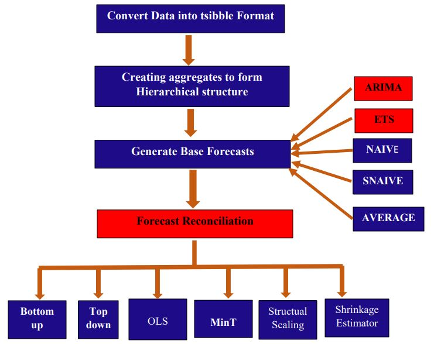
```

---

# Spatial hierarchical forecasting workflow

```{r}
fit_TRAIN <- HS_DataDengueTRAIN%>%
    model(arima =ARIMA(Counts),snaive=SNAIVE(Counts),naive=NAIVE(Counts),ets=ETS(Counts),avg =     MEAN(Counts))%>%
    fabletools::reconcile(bu_arima = bottom_up(arima),#<<
                          top_arima=top_down(arima),#<<
                          ols_arima=min_trace(arima,method="ols"),#<<
                          MinT_arima=min_trace(arima,method="mint_shrink"),#<<
                          wls_var_arima = min_trace(arima,method="wls_var"),#<<
                          wls_struct_arima=min_trace(arima,method="wls_struct"),#<<
                          MinT_cov_arima=min_trace(arima,method="mint_cov"),#<<
                          bu_ets = bottom_up(ets),#<<
                          top_ets=top_down(ets),#<<
                          ols_ets=min_trace(ets,method="ols"),#<<
                          MinT_ets=min_trace(ets,method="mint_shrink"),#<<
                          wls_var_ets = min_trace(ets,method="wls_var"),#<<
                          wls_struct_ets=min_trace(ets,method="wls_struct"),#<<
                          MinT_cov_ets=min_trace(ets,method="mint_cov"))#<<
```

---

# Spatial hierarchical forecasting workflow

```{r ,echo=FALSE, out.width = '50%', out.height = '5%',fig.height=7, fig.width=6,fig.align='center'}
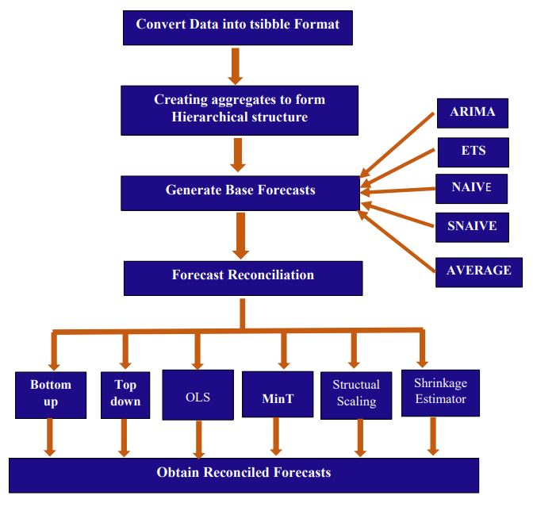
```

---

# Spatial hierarchical forecasting workflow

```{r}
fc_TRAIN <- fit_TRAIN %>% forecast(h = 52)
fc_TRAIN
```

---
## Reconciled forecasts


```{r ,echo=FALSE ,highlight.output=c(5)}
fc_TRAIN%>% dplyr::filter(is_aggregated(Districts))%>%dplyr::filter(Province=="Central")%>%dplyr::filter(.model==c("bu_arima"))%>%print(n=4)
```

```{r ,echo=FALSE ,highlight.output=c(5)}
fc_TRAIN%>%dplyr::filter(Districts=="NuwaraEliya")%>%dplyr::filter(.model==c("bu_arima"))%>%print(n=4)
```

---
## Reconciled forecasts

```{r ,echo=FALSE ,highlight.output=c(5)}
fc_TRAIN%>%dplyr::filter(Districts=="Kandy")%>%dplyr::filter(.model==c("bu_arima"))%>%print(n=4)
```

```{r ,echo=FALSE ,highlight.output=c(5)}
fc_TRAIN%>%dplyr::filter(Districts=="Matale")%>%dplyr::filter(.model==c("bu_arima"))%>%print(n=4)
```


---

# Spatial hierarchical forecasting workflow

```{r ,echo=FALSE, out.width = '47%', out.height = '5%',fig.height=7, fig.width=6,fig.align='center'}
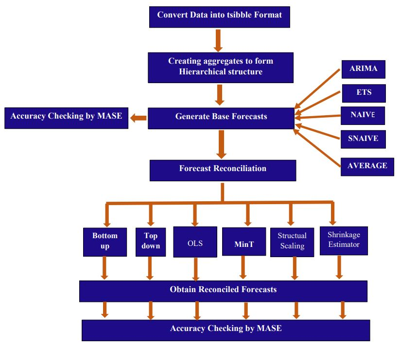
```

---

# Accuracy calculation - MASE

```{r ,echo=FALSE}
HS_DataDengueTEST<-DataDengueTEST%>%fabletools::aggregate_key(Province/Districts,Counts=sum(Counts))
```

```{r}
ac_TRAIN<-accuracy(fc_TRAIN, HS_DataDengueTEST)
ac_TRAIN_MASE<-ac_TRAIN[,c(1,2,3,10)]
ac_TRAIN_MASE
```

---

# Spatial hierarchical forecasting

```{r ,echo=FALSE, out.width = '100%', out.height = '90%',fig.height=8, fig.width=16,fig.align='center'}
knitr::include_graphics("Figures/SETS.JPG")
```

---

```{r ,echo=FALSE, out.width = '100%', out.height = '100%',fig.height=9, fig.width=16}
knitr::include_graphics("Figures/TR.JPG")
```

---

# The best forecasting approaches in districts

```{r ,echo=FALSE, out.width = '48%', out.height = '17%',fig.height=7, fig.width=14,fig.align='center'}
knitr::include_graphics("Figures/MAP1.JPG")
```

---

# The best forecasting approaches in provinces

```{r ,echo=FALSE, out.width = '48%', out.height = '17%',fig.height=7, fig.width=14,fig.align='center'}
knitr::include_graphics("Figures/MAP2.JPG")
```

---

# The best approach for forecasts in 2020 

```{r ,echo=FALSE, out.width = '42%', out.height = '10%',fig.height=7, fig.width=14,fig.align='center'}
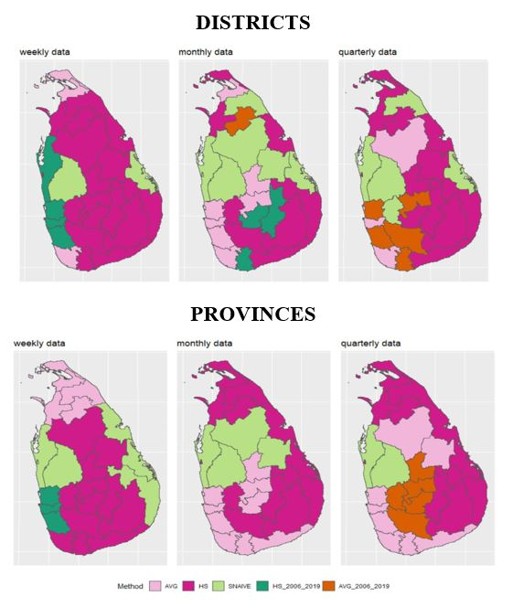
```

---

# Temporal hierarchical structure

```{r figurechapter0005, echo=FALSE, fig.align = 'center',message=FALSE, out.width = '100%', out.height = '5%',fig.height=5, fig.width=10}
knitr::include_graphics("Figures/F11.JPG")
```

---
# Compute all temporal aggregated time series

.left-column[
```{r , echo=FALSE, fig.align = 'center',message=FALSE, out.width = '80%', out.height = '80%',fig.height=4, fig.width=4}

```
]

.right-column[
```{r ,echo=FALSE}
D<-D%>%dplyr::filter(Week!=53)

Dengue_Disease<-D[,c(5,6,7)]
Dengue_Disease_tsbl<-Dengue_Disease%>%as_tsibble(key=Division,index=EndDate)
Weekly_Dengue<-Dengue_Disease_tsbl%>%
  tsibble::index_by(WD=~yearweek(.))%>%
  dplyr::summarise(Dengue=sum(Dengue))
Dengue_total_data<-c(Weekly_Dengue$Dengue)

```

```{r }
Dengue_total_data<- ts(Dengue_total_data, freq=52, start=c(2006,52))
Dengue_train_data<- window(Dengue_total_data , start = c(2006,52), end = c(2019,51), frequency = 52)
aggts_total = thief::tsaggregates(Dengue_total_data)#<<
aggts_train = thief::tsaggregates(Dengue_train_data)#<<
summary(aggts_total)

```
]

---
# Compute base forecasts

.left-column[
```{r , echo=FALSE, fig.align = 'center',message=FALSE, out.width = '80%', out.height = '80%',fig.height=4, fig.width=4}

```
]

.right-column[
```{r}
base <- list()
for(i in seq_along(aggts_train))
base[[i]] <- forecast(forecast::auto.arima(aggts_train[[i]]),
                          h=1*frequency(aggts_train[[i]]))
base
# forecast::ets, forecast::snaive, forecast::naive, forecast::meanf
```

]

---

# Reconcile forecasts

```{r}
reconciled <- thief::reconcilethief(base,comb = c("bu"))
# comb = c("bu","ols","struc","shr")
reconciled
```

---

# Accuracy checking 

#### Weekly series accuracy 

```{r}
accuracy(reconciled[[1]],aggts_total[[1]])[,"MASE"]
```

#### Bi-weekly series accuracy 

```{r}
accuracy(reconciled[[2]],aggts_total[[2]])[,"MASE"]
```

#### Monthly series accuracy 

```{r}
accuracy(reconciled[[3]],aggts_total[[3]])[,"MASE"]
```

---

#  The best forecasting approaches for temporal granualities

```{r ,echo=FALSE, fig.align = 'center',message=FALSE, out.width = '100%', out.height = '50%',fig.height=8, fig.width=10}
knitr::include_graphics("Figures/TEMAGGRESULTS.JPG")
```

---
class: center, middle

# Thank you!

Slides created via the R packages:

[**xaringan**](https://github.com/yihui/xaringan)<br>
[gadenbuie/xaringanthemer](https://github.com/gadenbuie/xaringanthemer)

The chakra comes from [remark.js](https://remarkjs.com), [**knitr**](http://yihui.name/knitr), and [R Markdown](https://rmarkdown.rstudio.com).
